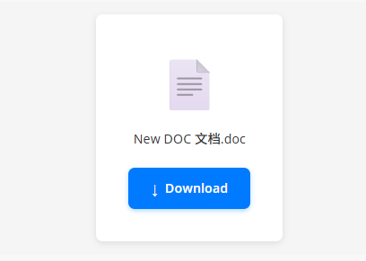
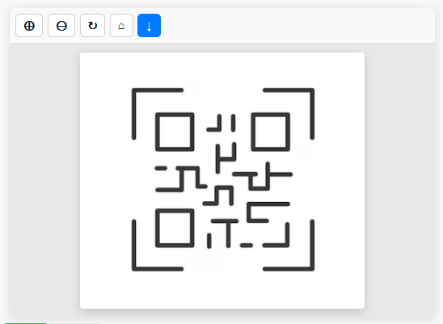

# Mendix File Displayer Widget

A lightweight file viewer widget for Mendix applications that displays images and PDFs with native browser capabilities, plus download support for Office files and other file types.

**Maintained by Zhejiang Lanbojini Knitting Co.,Ltd.**

**Contact**: xie_Jiahong@labull.org.cn

## 📱 Usage

See the widget in action:




## 🚀 Features

- **Image Support**: Display JPG, PNG, GIF, WebP, BMP, SVG images with full zoom and rotate controls
- **PDF Support**: Display PDF files using the browser's native PDF viewer with zoom controls  
- **Download Support**: Download Office files and other file types that cannot be displayed inline
- **Drag Support**: Drag images around for better viewing
- **Zoom Controls**: Zoom in/out with fine-grained control (0.25x to 5x)
- **Rotation**: Rotate images in 90-degree increments
- **Download Button**: Download any file directly from the viewer
- **Offline Support**: Works completely offline for images and PDFs without external dependencies
- **Responsive Design**: Beautiful, modern UI that works on all screen sizes
- **Zero External Dependencies**: Lightweight implementation using only browser capabilities

## 📋 Supported File Types

### Display (Full Viewer with Controls)
- **Images**: jpg, jpeg, png, gif, webp, bmp, svg
- **PDFs**: pdf files using browser's native viewer

### Download Only
- **Office Files**: .doc, .docx, .xlsx, .xls, .pptx, .ppt
- **All Other File Types**

## 📱 Usage

1. Add the File Displayer widget to your Mendix page
2. Bind a File attribute or FileManager file to the widget's `file` property
3. The widget will automatically detect the file type and display it appropriately
   - Images and PDFs will be displayed with viewer controls
   - Office files and other file types will show a download button

## ⚙️ Configuration

### Basic Configuration

The widget has a simple configuration:

#### General Properties
- **File**: Required file attribute to display
- **Class**: Optional custom CSS class
- **Style**: Optional inline styles

### Features
- **Automatic File Type Detection**: The widget automatically detects file types from the extension
- **Zoom Controls**: Built-in zoom in/out buttons (0.25x to 5x)
- **Rotate Control**: Rotate images in 90-degree increments
- **Drag Images**: Drag images to reposition them for better viewing
- **Reset Button**: Reset zoom and rotation to default values
- **Download Button**: Always available to download any file

## 🎯 Use Cases

### Document Management
- View uploaded documents and images
- PDF document viewer
- Image gallery with zoom and rotate

### Contract Management
- Review PDF contracts
- View scanned documents
- Download contract files

### Media Management
- Image preview with zoom
- Product photo galleries
- Document visualization

### Data Visualization
- Display charts and graphs (as images)
- PDF reports viewer
- Infographic display

## 🔧 Development

### Building from Source

1. **Clone the repository**
   ```bash
   git clone https://github.com/labullorg/MendixWidget-FileDisplayer.git
   cd MendixWidget-FileDisplayer
   ```

2. **Install dependencies**
   ```bash
   npm install
   ```
   
   If you use NPM v7.x.x, execute:
   ```bash
   npm install --legacy-peer-deps
   ```

3. **Start development server**
   ```bash
   npm start
   ```

4. **Build for production**
   ```bash
   npm run build:prod
   ```

### Project Structure

```
fileDisplayer/
├── src/
│   ├── FileDisplayer.tsx                # Main widget component
│   ├── FileDisplayer.xml               # Widget configuration
│   ├── FileDisplayer.editorConfig.ts   # Editor configuration
│   ├── FileDisplayer.editorPreview.tsx # Preview component
│   ├── ui/
│   │   └── FileDisplayer.css          # Widget styles
│   ├── components/
│   │   └── HelloWorldSample.tsx       # Sample component
│   └── package.xml                     # Package manifest
├── typings/
│   └── FileDisplayerProps.d.ts         # Type definitions
├── dist/                               # Built widget files
├── assets/                             # Demo images
│   ├── demo1.png
│   └── demo2.png
├── package.json                        # Dependencies and scripts
├── tsconfig.json                       # TypeScript configuration
├── LICENSE                             # License file
└── README.md                           # This file
```

### Dependencies

- **@mendix/pluggable-widgets-tools**: ^10.24.0 - Mendix widget development tools
- **classnames**: ^2.2.6 - CSS class name utilities

**Note**: This widget has ZERO external dependencies for file viewing - it uses only native browser capabilities!

## 🌐 Browser Support

- Chrome 60+
- Firefox 55+
- Safari 11+
- Edge 79+
- Mobile browsers (iOS Safari, Chrome Mobile)

## 🔑 Key Features

### Image Viewing
- Full zoom control (0.25x to 5x)
- Rotate in 90-degree increments
- Drag to reposition
- Reset to default view
- Smooth transitions

### PDF Viewing
- Browser's native PDF viewer
- Zoom controls
- Full-screen capable

### Download Support
- Clean download interface
- File type icon display
- Direct download button

## 🐛 Troubleshooting

### Common Issues

#### File Not Loading
- **Check file availability**: Ensure the file status is "available"
- **Check file URL**: Verify the file attribute has a valid URI
- **Network issues**: For PDFs, ensure the file URL is accessible

#### PDF Not Displaying
- **Browser PDF support**: Ensure your browser supports inline PDF viewing
- **CORS issues**: Verify the PDF URL allows cross-origin requests

#### Image Not Displaying
- **File format**: Check if the image format is supported
- **File size**: Very large images may load slowly
- **File URL**: Verify the image URL is accessible

### Debug Mode

Enable debug logging by opening browser console. The widget provides detailed logging for:
- File type detection
- File loading status
- Error handling
- Blob URL management

## 📝 License

This project is licensed under the Apache License 2.0 - see the [LICENSE](LICENSE) file for details.

## 🤝 Contributing

1. Fork the repository
2. Create a feature branch (`git checkout -b feature/amazing-feature`)
3. Commit your changes (`git commit -m 'Add some amazing feature'`)
4. Push to the branch (`git push origin feature/amazing-feature`)
5. Open a Pull Request

## 📞 Support

- **Contact**: xie_Jiahong@labull.org.cn
- **Issues**: [GitHub Issues](https://github.com/labullorg/MendixWidget-FileDisplayer/issues)
- **Documentation**: [Mendix Documentation](https://docs.mendix.com/)

## 🔄 Version History

### v1.0.0
- Initial release
- Image viewing with zoom, rotate, and drag
- PDF viewing with native browser support
- Download support for Office and other file types
- Offline support
- Zero external dependencies

## 🙏 Acknowledgments

- [Mendix](https://www.mendix.com/) for the platform and widget development tools
- Contributors and users who provide feedback and suggestions
- **Zhejiang Lanbojini Knitting Co.,Ltd.** for maintaining and supporting this widget

---

**Made with ❤️ by Zhejiang Lanbojini Knitting Co.,Ltd. for the Mendix community**

**Contact**: xie_Jiahong@labull.org.cn

---

**About Zhejiang Lanbojini Knitting Co.,Ltd.**: Zhejiang Lanbojini Knitting Co.,Ltd. is a professional garment manufacturing enterprise that integrates men's and women's clothing design, production, and service. With 33 years of expertise in the sweater industry, the company has always adhered to the business philosophy of "integrity, cooperation, and mutual benefit." Relying on superb technology, advanced equipment, strict management, and thoughtful after-sales service, every product design strives for perfection and leads fashion trends. The company has an experienced professional measurement team and a complete set of service concepts for various industries, fully reflecting the design philosophy of "working with customers as one." The company always puts "quality first" at the forefront, with a professional quality department controlling every process. "No defective products, only fine products" is our consistent quality philosophy. The company owns more than 1,300 computerized flat knitting machines from Shima Seiki and Cixing, plus over 1,000 advanced equipment including fully automatic ironing machines, dryers, flat sewing machines, overlock machines, linking machines, and buttonhole machines. With approximately 1,200 employees, from a single yarn to a finished garment, we have a complete production chain with significant price advantages and quality assurance.
